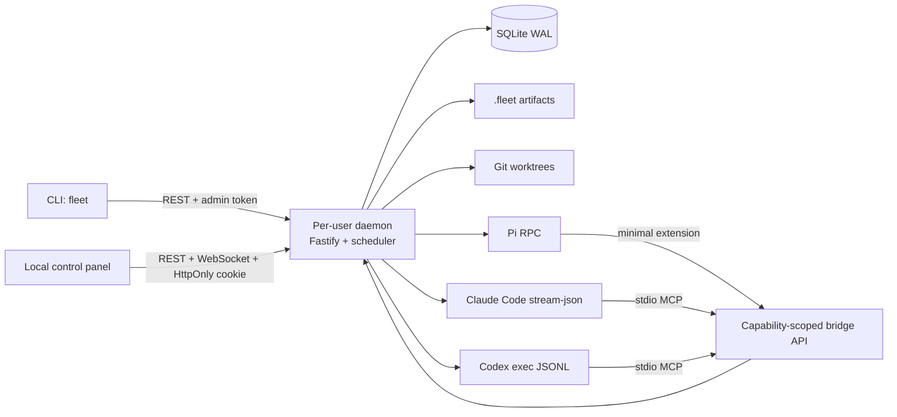

# Architecture

Harness Fleet is a local control plane, not an agent development environment.
It deliberately has no code editor, arbitrary terminal, remote execution, or
multi-user collaboration.



The daemon is the sole scheduling authority. It binds to `127.0.0.1` on a
dynamic port and writes a user-private descriptor containing its PID, port,
and admin secret. An exclusive lock prevents two daemon instances. A
transactional, expiring fleet lease prevents double scheduling.

## Package boundaries

- `packages/protocol`: public types, schema, adapter contract, normalized
  events, and safe child-process primitives.
- `packages/core`: spec validation, DAG ordering, scheduler, reviewer loops,
  contracts, prompts, and reports. It imports no concrete harness.
- `packages/storage`: numbered SQLite migrations, repositories, capability
  tokens, messages, events, and attempt paths.
- `packages/adapter-*`: one process integration per harness.
- `packages/bridge-mcp` and `packages/bridge-pi`: restricted agent tools.
- `packages/git-workspaces`: branches, worktrees, merge integration, cleanup.
- `apps/daemon`, `apps/cli`, and `apps/web`: the three user-facing
  process/UI layers.

## Persistence

SQLite stores definitions and queryable state. Events are append-only; fleet
and node rows are derived snapshots. Large or human-readable data stays in:

```text
<repo>/.fleet/<fleet-id>/
  fleet.json
  workers/<node>/attempts/<n>/
    prompt.md
    stdout.log
    stderr.log
    events.jsonl
    outputs/
  worktrees/<node>/attempt-<n>/
```

Attempt numbers and directories are never reused. On restart, the daemon
reconciles running process IDs, terminates detached orphan trees, marks their
attempts retryable, and resumes scheduling without repeating completed nodes.

## Trust boundaries

The local CLI/web human, orchestrator, and each worker receive different
capabilities. Tokens are random, stored only as SHA-256 hashes, expire, and
are scoped to a fleet and optionally node/attempt. See
[security-and-permissions.md](security-and-permissions.md).
