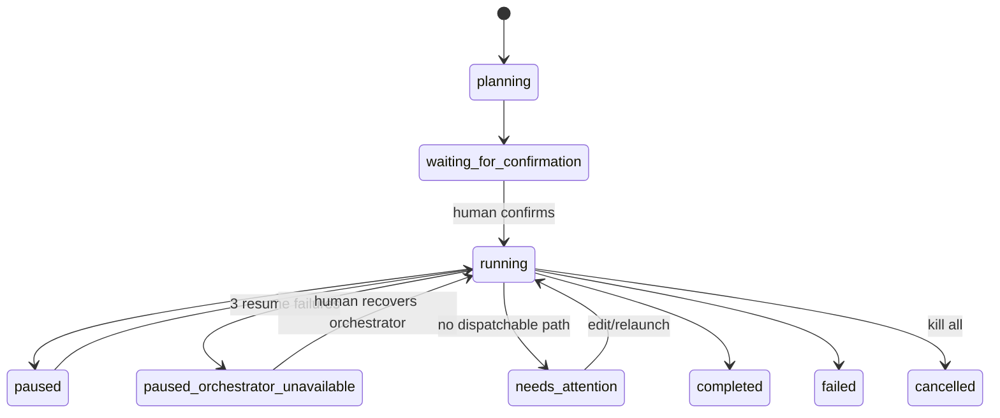
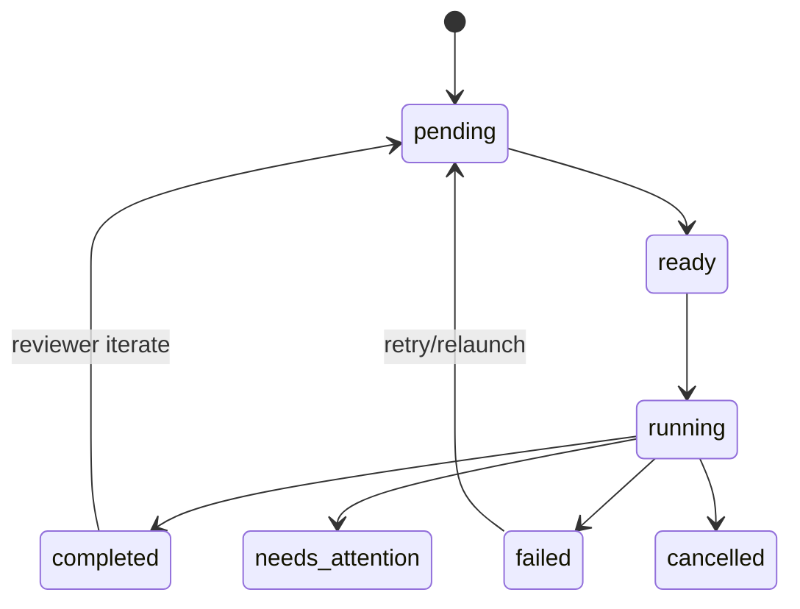

# Lifecycle and state machines

## Fleet

The scheduler never dispatches from `waiting_for_confirmation`. Pausing
prevents new dispatch but does not implicitly kill running agents. Kill all
terminates process trees and marks the fleet cancelled.

## Node and attempt

Each transition into `running` creates a monotonically numbered attempt
record and a new directory. Attempts are immutable historical facts even when
the node is relaunched with another model or harness.

## Review loop

The configured gate emits `review.verdict`. `iterate` resets the selected
`reviewer_for` nodes (or direct dependencies) and the reviewer to pending,
while preserving their earlier attempts and branches. `LGTM` increments the
approval counter. The loop completes at `lgtm_count`; it moves to
`needs_attention` at `max_iterations` or on an unclear verdict.

## Restart

SQLite commits precede scheduling side effects where possible. At daemon
startup, running process IDs are reconciled. Unmanaged orphan trees are killed,
their attempts become retryable, completed nodes remain completed, and every
running fleet is ticked again under a fresh lease.
